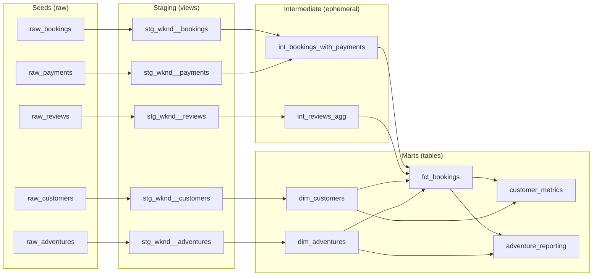

# WKND Analytics — dbt Portfolio Project

A dbt project modeling a fictional adventure-travel company (WKND): customers, adventures, bookings, payments, and reviews. Built to demonstrate a realistic, production-style analytics engineering workflow — layered modeling, data testing, and reproducibility — end to end on a fully local stack (no cloud account required to run it).

## Why DuckDB

This project runs entirely on [DuckDB](https://duckdb.org/) via [dbt-duckdb](https://github.com/duckdb/dbt-duckdb) rather than a hosted warehouse. That means anyone cloning this repo can run the full pipeline — seeds, models, and tests — in seconds, with zero cloud credentials, trial accounts, or billing setup. The modeling patterns here (staging → intermediate → marts, testing, custom macros) are exactly what you'd use against Snowflake, BigQuery, or Redshift; only the connection config in `profiles.yml` would change.

## Architecture



**Layers:**
- **Seeds** — synthetic CSV data standing in for a raw source system (see `scripts/generate_seed_data.py`, seeded with a fixed random seed for reproducibility).
- **Staging** — one view per source table: renaming, type casting, no joins. Only layer allowed to reference `source()`.
- **Intermediate** — ephemeral models that collapse one-to-many relationships (bookings can have multiple payments — a deposit + balance — and, in principle, multiple reviews) into one row per booking, so downstream joins can't silently fan out and double-count revenue.
- **Marts** — the query-ready layer: two dimensions, one fact table, and two pre-aggregated reporting models with business metrics (customer lifetime value, adventure revenue ranking, cancellation rates).

## Notable design decisions

- **Custom `generate_schema_name` macro** — overrides dbt's default schema-prefixing behavior so seeds/staging/marts land in clean, exactly-named schemas (`raw`, `staging`, `marts`) instead of `target_schema_raw`, etc.
- **Weighted average ratings, not average-of-averages** — `customer_metrics` and `adventure_reporting` compute rating averages as `sum(avg_rating * review_count) / sum(review_count)`, correctly weighting each booking's rating by how many reviews backed it, rather than treating every booking as an equally-weighted data point regardless of review volume.
- **Fan-out protection** — both payments and reviews are pre-aggregated to one row per `booking_id` in the intermediate layer before being joined into `fct_bookings`, specifically to prevent duplicate rows (and the double-counted revenue that would follow) if a booking ever has more than one payment or review.
- **35 data tests** across the project: uniqueness/not-null on every primary key, referential integrity (`relationships`) between bookings and its parent customers/adventures and between payments/reviews and their parent bookings, and `accepted_values` on status-like enum columns.

## Project structure

```
├── seeds/                      # Synthetic raw CSV data
├── scripts/
│   └── generate_seed_data.py   # Reproducible seed data generator (fixed random seed)
├── models/
│   ├── staging/wknd/           # 1:1 cleanup of raw sources
│   ├── intermediate/           # Ephemeral fan-out-safe aggregations
│   └── marts/
│       ├── core/               # dim_customers, dim_adventures, fct_bookings
│       └── reporting/          # customer_metrics, adventure_reporting
├── macros/
│   ├── generate_schema_name.sql
│   └── days_between.sql        # Custom macro used to compute customer tenure
├── dbt_project.yml
├── packages.yml                 # dbt_utils
└── profiles.yml                  # DuckDB connection (committed — no secrets, pure local file)
```

## Getting started

```bash
git clone https://github.com/bluelion1999/wknd_analytics_dbt.git
cd wknd_analytics_dbt

python -m venv .venv
# Windows:
.venv\Scripts\activate
# macOS/Linux:
source .venv/bin/activate

pip install dbt-core dbt-duckdb
dbt deps

# profiles.yml lives in the project root rather than ~/.dbt/, so point dbt at it:
export DBT_PROFILES_DIR=.        # PowerShell: $env:DBT_PROFILES_DIR = "."

dbt build          # seeds + models + tests, in dependency order
dbt docs generate
dbt docs serve      # interactive lineage graph + column-level docs
```

## Tech stack

- [dbt-core](https://github.com/dbt-labs/dbt-core) 1.12
- [DuckDB](https://duckdb.org/) via [dbt-duckdb](https://github.com/duckdb/dbt-duckdb)
- Python 3.13 (seed data generation only — not a runtime dependency of the dbt project itself)
